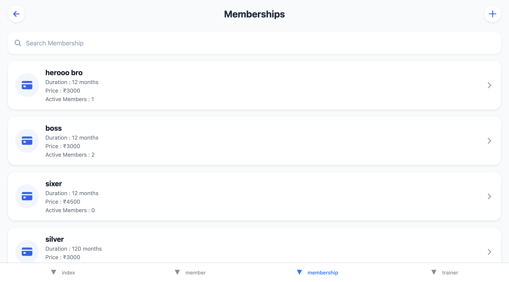
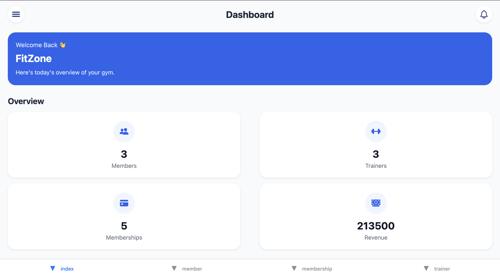
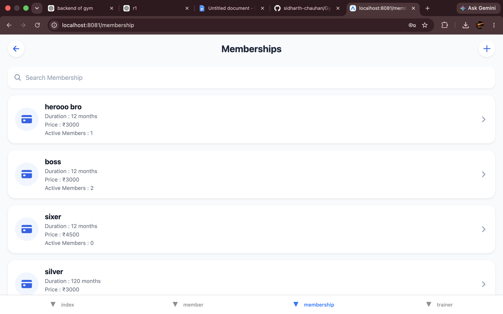
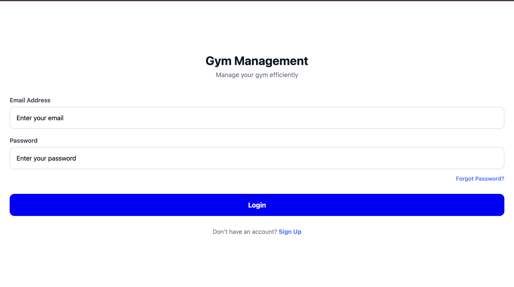
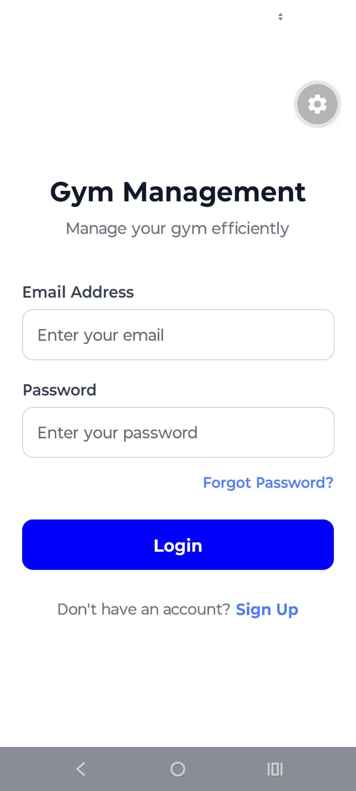

# 🏋️ Gym Management System - Frontend

A modern **Gym Management System** mobile application built using **React Native (Expo)**. This application enables gym owners to efficiently manage members, trainers, membership plans, and monitor gym statistics through a clean and user-friendly interface.

---

# 📱 Features

### 🔐 Authentication

- Gym Owner Registration
- Secure Login
- JWT Authentication
- Persistent Login using AsyncStorage
- Logout

---

### 📊 Dashboard

- Total Members
- Total Trainers
- Total Membership Plans
- Total Revenue
- Clean Analytics Dashboard

---

### 👥 Member Management

- View Members
- Add New Member
- Assign Trainer
- Assign Membership Plan
- Select Date of Birth
- Form Validation

---

### 💪 Trainer Management

- View Trainers
- Add Trainer
- Experience
- Specialization

---

### 🏆 Membership Management

- View Membership Plans
- Add Membership Plan
- Duration
- Price

---

### 🎨 UI Features

- Modern UI Design
- Responsive Layout
- FlatList
- Dropdown Selection
- Date Picker
- Loading States
- Form Validation

---

# 🚀 Tech Stack

- React Native
- Expo
- TypeScript
- Expo Router
- Axios
- AsyncStorage
- React Hooks
- React Native Vector Icons

---

# 📂 Project Structure

```text
app
│
├── (auth)
│   ├── login.tsx
│   └── register.tsx
│
├── (tabs)
│   ├── dashboard.tsx
│   ├── member.tsx
│   ├── trainer.tsx
│   └── membership.tsx
│
├── member
│   └── add.tsx
│
├── trainer
│   └── add.tsx
│
├── membership
│   └── add.tsx
│
├── _layout.tsx
└── index.tsx

api
│
├── api.ts
└── routes.ts
```

---

# 📸 Screenshots

## Login



---

## Dashboard



---

## Members



---

## Trainers



---

## More Screens



---


---


---


---


---

# 🎥 Demo

A complete application demo showcasing:

- Authentication
- Dashboard
- Member Management
- Trainer Management
- Membership Management
- Add Forms
- Navigation

_(Demo video will be added soon.)_

---

# ⚙️ Getting Started

## Clone Repository

```bash
git clone https://github.com/sidharth-chauhan/Gym_Management.git
```

---

## Install Dependencies

```bash
npm install
```

---

## Start Expo

```bash
npx expo start
```

---

## Run Android

```bash
npx expo run:android
```

---

## Run iOS

```bash
npx expo run:ios
```

---

# 🔧 Backend Configuration

Update the backend URL inside

```text
api/api.ts
```

Example

```ts
const api = axios.create({
  baseURL: "http://YOUR_LOCAL_IP:3000/api",
});
```

### Android Emulator

```
http://10.0.2.2:3000/api
```

### Physical Device

```
http://YOUR_WIFI_IP:3000/api
```

---

# 🔐 Authentication

JWT Token is securely stored using **AsyncStorage**.

Every protected API request automatically sends:

```
Authorization: Bearer <JWT_TOKEN>
```

---

# 📚 What I Learned

- React Native
- Expo Router
- TypeScript
- REST API Integration
- JWT Authentication
- AsyncStorage
- Axios
- FlatList
- Dropdown Implementation
- Date Picker
- Form Handling
- Navigation
- Mobile UI Design

---

# 🚀 Future Improvements

- Edit Member
- Delete Member
- Edit Trainer
- Delete Trainer
- Edit Membership
- Delete Membership
- Search
- Pull To Refresh
- Pagination
- Charts
- Push Notifications
- Docker Deployment
- AWS Deployment

---

# 🔗 Backend Repository

Backend API for this project:

**https://github.com/sidharth-chauhan/Gym_Management_Api**

---

# 👨‍💻 Author

**Sidharth Chauhan**

GitHub:
https://github.com/sidharth-chauhan

LinkedIn:
https://www.linkedin.com/in/sidharth-chauhan-8a010229a/

---

⭐ If you found this project helpful, consider giving it a **Star**.
